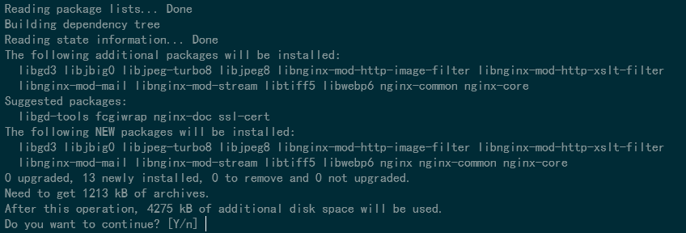
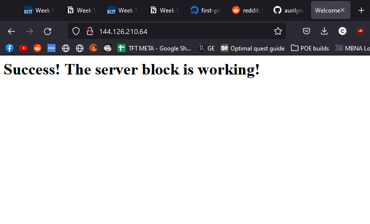
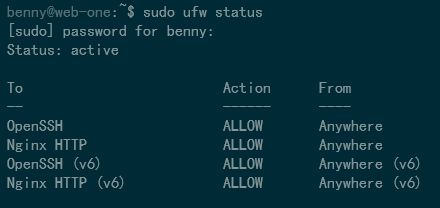

# 2420_week12_Lab

## Installing NGINX

To install NGINX, you go into your Linux and type the following:

```
    sudo apt install nginx
```

After typing that into your terminal, you will be prompted with a yes or no. Type Y to continue.



You'll have installed NGINX after these steps.

## Creating HTML to serve

You'll be creating an HTML document to serve. This is to ensure that you connect the html with the server block that we'll create later. This will be created in the home directory in WSL

For this lab, this will be my HTML document called index.html:

```
    <html>
        <head>
            <title>Welcome</title>
        </head>
        <body>
            <h1>Success! The server block is working!</h1>
        </body>
    </html>
```

## Creating Server Block

You'll be creating a server block so that you can serve the HTML document. This will also be created in the home directory in WSL.

The server block is going to be as follows:

```
    server {
        listen 80;
        listen [::]:80;

        root /var/www/<ip_address>/html;

        index index.html index.htm index.nginx-debian.html;

        server_name <ip_address>;

        location / {
            try_files $uri $uri/ =404;
        }

    }

```

You'll have noticed that I put placeholder for IP address as that will vary depending on your domain. You will most likely need to make a new directory with the name of your domain and create the html directory in the new directory so that you can move index.html into.

## Uploading files from WSL to your Droplet

With the two files being stored on your WSL, you will need to move it from WSL to your droplet. To do so, you will need to sftp into your droplet from within your WSL. To do so, type in the following:
```
    sftp -i "~/.ssh/<key>" [user]@ip_address
```

After this, in order to get the files into your dropet, type in the following:
```
    put index.html
```

and

```
    put server_block_name
```

If it is successful, this should be the expected output:


Now that the files are in your home directory, before moving it the respective directories, we should change owenership and permissions to ensure that everything works properly.

We will be changing the ownership of /var/www/ip/html to your user in case the ownership is root. We will also give it permission to RWX for user, and RX permission for group and others.

 


After changing permissions and ownership, you'll need to move the files into the respective directories. You will need to use sudo in order to move the server block into /sites-available/

 

After completing steps, restart the service to ensure the changes are applied. To restart the service, type in:

```
    sudo system restart nginx
```
There won't be any output but it should look like this : 


## Checking to make sure the document is served

To check whether or not the document is served properly, you type in the IP address into your address bar of your browser, and if you see yout HTML, then it will have been served properly. The result so be something like this:



## Enabling Firewall

We will be setting up firewall via UFW. You need to first enable the Firewall with this command:

```
    sudo ufw enable
```
You will be prompted with a confirmation, type in Y to continue. After enabling firewall, you will need to allow OpenSSH and Nginx HTTP so that you can still connect to droplet with SSH and allow HTTP connections.

This is should be your result:


To ensure that all your firewall settings have applied properly, type in the following command:

```
    sudo ufw status
```
If everything was executed properly, the result should be this:



After you enable firewall, ensure that you are still able to connect to your server with ssh and that you are still serving the document properly by visiting the IP address in the browser.